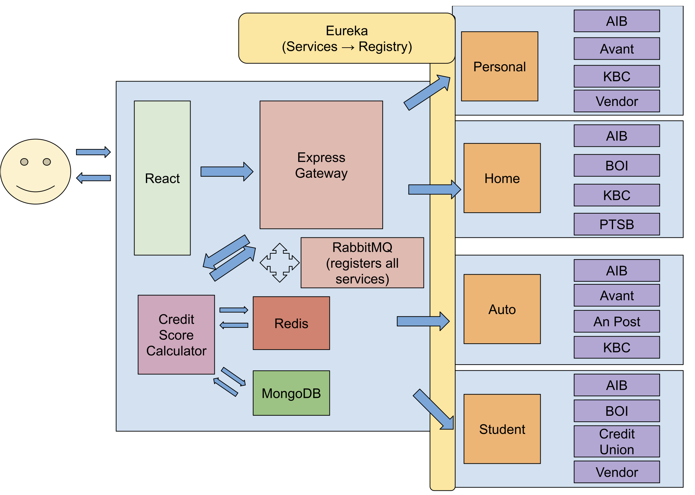

# COMP41720 Distributed Systems Final Project - FinTech Service Aggregator
## Overview
- This is a loan generation application which allows users to compare student, car, personal, and home loans from multople providers. We developed this application for our final project for Distributed Systems.
- Implements a microservices-based architecture to guarantee scalability.
- Frontend powered by React, enabling users to input details, generate credit scores, and compare loan offers.
- Employs Express Gateway as middleware to handle frontend requests and distribute loan offers efficiently.
- Leverages Eureka for service registration and discovery, enhancing the application's reliability and robustness.
- Utilises Flask-based services for calculating credit scroes, with Redis cache for efficient storage and MongoDB for permanent document-based storage
- Implements RabbitMQ messaging queues to facilitate seamless communication between the gateway app and loan service registries, simplifying development and ensuring compatibility with ExpressJS.
- The full report can be read [here](Distributed%20System%20-%20Final%20Project%20Report.pdf)

Overview of the System Architecture

## How to run our application:
* If using a Mac laptop, turn off Airplay Receiver on System Settings > General > AirDrop & Handoff > Airplay Receiver.
* Open two tabs in your terminal and cd your terminal 1 window into the root of the project and cd your terminal 2 into the loan-services directory.
* In the terminal 1 window, run “docker network create shared_network”. Once the shared_network network has been created, cd into the application directory.
* Run “docker build” in the terminal 1 window and then in the terminal 2 window.
* Run “docker compose up” in the terminal 1 window and then in the terminal 2 window.
* Then open a browser and submit a fully populated form using localhost:3000
* You should see the response with quotations in the browser.

## Link to Report
Our written [report](https://github.com/harryocleirigh/distributed-systems-project/blob/production/Distributed%20System%20-%20Final%20Project%20Report.pdf).

## Link to Video
Our video [demo](https://github.com/harryocleirigh/distributed-systems-project/blob/production/Distributed%20System%20-%20Final%20Project%20Video%20Submission.mp4)
